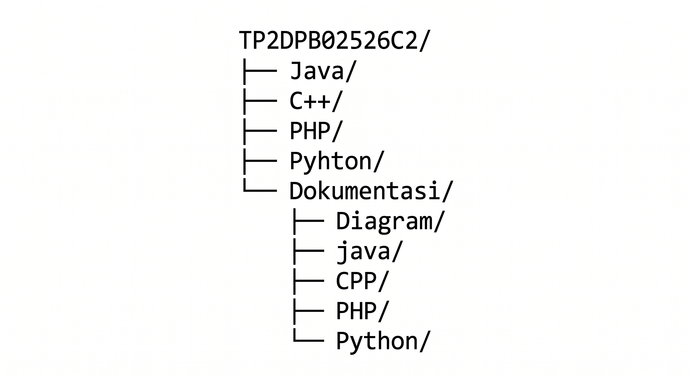
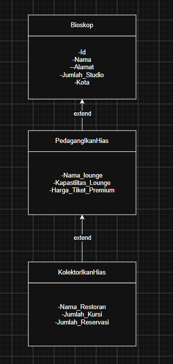

# JANJI

Saya Renaldy Heryana dengan NIM 2509867 mengerjakan Tugas Praktikum 2 dalam mata kuliah Desain dan Pemrograman Berorientasi Objek untuk keberkahanNya maka saya tidak melakukan kecurangan seperti yang telah dispesifikasikan. Aamiin.

# STRUKTUR REPO

# DESIGN DIAGRAM

# ALUR PROGRAM

1. Program memuat 5 data default/awal.
2. User dapat memilih opsi untuk menampilkan data/menambahkan data.
3. Semua data dapat ditampilkan di tabel dinamis.
4. User dapat menginput data baru.
5. Pada PHP dapat mengupload gambar ke atribut foto.
6. Khusus di PHP, untuk merestart data dan kembali hanya 5 atribut awal bisa dilakukan dengan menekan tombol Reset Data

# ERROR HANDLING

Error handling saya buat ketika user memasukan sesuatu yang salah, misal user memasukan selain angka di masukan khusus angka 
seperti id dan jumlah_studio, maka user harus mengulang masukan, contoh kedua ketika user memasukan id yang sudah ada di dalam data,
maka user harus memasukan data nya ulang.

# PENJELASAN ATRIBUT DAN METHOD

Disini adalah penjelasan berbagai atribut dan method dari code yang saya buat dari setiap class

## CLASS Bioskop

Penjelasan atribut dan method dari class Bioskop

### ATRIBUT

- ID, Adalah atribut yang saya buat sebagai kode unik dari semua data yang ada
- Nama, Adalah atribut yang mewakili nama dari Bioskop nya
- Alamat, Adalah atribut yang mewakili alamat dari objek Bioskop
- Jumlah Studio, Adalah atribut untuk mewakili berapa jumlah studi yang ada
- Kota, Adalah atribut yang mewakili kota dari bioskop

### METHOD

- getid dan set id, adalah method untuk mendapatkan (get) dan mengubah (set) nilai id dari kelas ini
- getnama dan setnama, adalah method untuk mendapatkan (get) dan mengubah (set) nilai nama dari kelas ini
- getalamat dan setalamat, adalah method untuk mendapatkan (get) dan mengubah (set) nilai alamat dari kelas ini
- getjumlah_studio dan setjumlah_studio, adalah method untuk mendapatkan (get) dan mengubah (set) nilai jumlah studio dari kelas ini
- getkota dan setkota, adalah method untuk mendapatkan (get) dan mengubah (set) nilai kota dari kelas ini

## CLASS BioskopPremium

Penjelasan atribut dan method dari class BioskopPremium

### ATRIBUT

- nama_lounge, adalah atribut untuk mewakili nama lounge yang ada di bioskop premium
- kapasitas_lounge, adalah atribut untuk mewakili kapasitas lounge yang ada di bioskop premium
- harga_tiket_premium, adalah atribut untuk mewakili harga tiket premium yang ada di bioskop premium

### METHOD

- getkapasitaslounge dan setkapastaslounge, adalah method untuk mendapatkan (get) dan mengubah (set) nilai nama_lounge dari kelas ini
- getkapasitaslounge dan setkapasitaslounge, adalah method untuk mendapatkan (get) dan mengubah (set) nilai kapasitas_lounge dari kelas ini
- gethargatiketpremium dan sethargatiketpremium, adalah method untuk mendapatkan (get) dan mengubah (set) nilai harga_tiket_lounge dari kelas ini

## CLASS BioskopLuxury

Penjelasan atribut dan method dari class BioskopLuxury

### ATRIBUT

- nama_restoran, adalah atribut untuk mewakili nama restoran yang ada di bioskop premium
- jumlah_meja, adalah atribut untuk mewakili jumlah meja yang ada di restoran yang ada di bioskop premium
- jumlah_reservasi, adalah atribut untuk mewakili jumlah reservasi yang ada di bioskop premium

### METHOD

- getnamarestoran dan setnamarestoran, adalah method untuk mendapatkan (get) dan mengubah (set) nilai nama_restoran dari kelas ini
- getjumlahmeja dan setjumlahmeja, adalah method untuk mendapatkan (get) dan mengubah (set) nilai jumlah_meja dari kelas ini
- getjumlahreservasi dan setjumlahreservasi, adalah method untuk mendapatkan (get) dan mengubah (set) nilai jumlah_reservasi dari kelas ini

# DOKUMENTASI

## JAVA

## C++

## PYTHON 

## PHP

